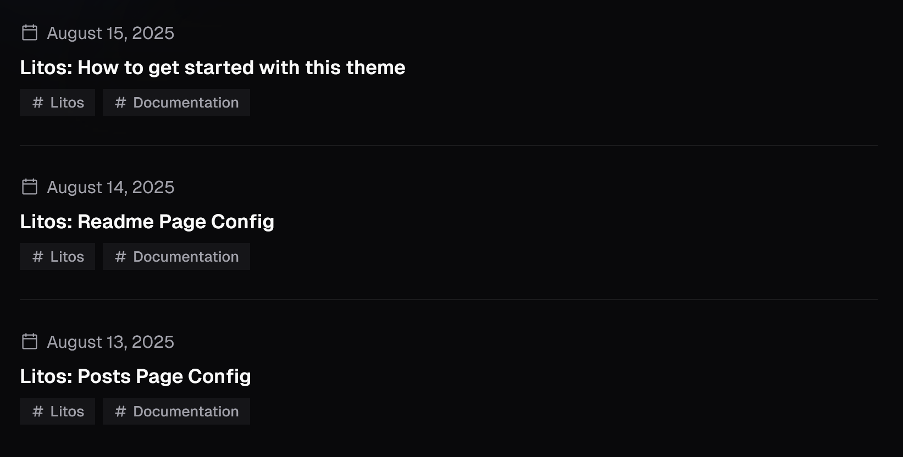
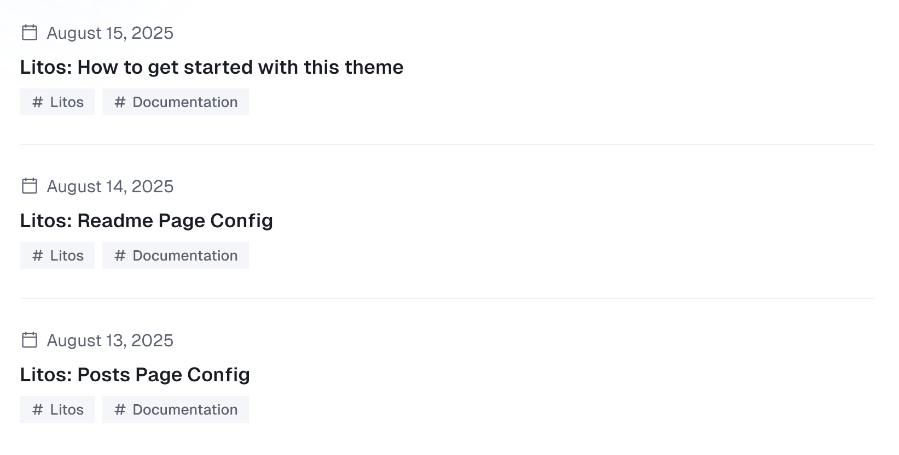

The following files are compatible with this document:

- `src/pages/posts/[...id].astro` - post specific content display page.
- `src/pages/posts/[...page].astro` - post list page.
- `src/content.config.ts` - posts dataset and frontmatter configuration.
- `ec.config.mjs` - expressiveCode config.
- `plugins/index.ts` - remark and rehype plugins.
- `src/config.ts` - posts page config.
- `src/components/posts` - most of the components come from here.

### Posts Page Config

The posts page config is configured in the following code:

```ts title="config.ts"
export const POSTS_CONFIG: PostConfig = {
  title: 'Posts',
  description: 'Posts by Dnzzk2',
  introduce: 'Here, I will share the usage instructions for this theme to help you quickly use it.',
  author: 'Dnzzk2',
  homePageConfig: {
    size: 3,
    type: 'compact',
  },
  postPageConfig: {
    size: 10,
    type: 'minimal',
  },
  tagsPageConfig: {
    size: 10,
    type: 'time-line',
  },
  ogImageUseCover: false,
  postType: 'metaOnly',
  imageDarkenInDark: true,
  readMoreText: 'Read more',
  prevPageText: 'Previous',
  nextPageText: 'Next',
  tocText: 'On this page',
  backToPostsText: 'Back to Posts',
  nextPostText: 'Next Post',
  prevPostText: 'Previous Post',
  recommendText: 'REC',
}
```

There are a few configuration attributes, please refer to the table below for details.

| Property                                                                    | Description                                                                                                                                                                       |
| --------------------------------------------------------------------------- | --------------------------------------------------------------------------------------------------------------------------------------------------------------------------------- |
| title                                                                       | Title displayed on browser tags and title displayed on list pages.                                                                                                                |
| description                                                                 | The metadata description in the `head` element of the list page.                                                                                                                  |
| introduce                                                                   | The introduce below the title on the list page.                                                                                                                                   |
| author                                                                      | The author of the posts.                                                                                                                                                          |
| homePageConfig                                                              | **readme page** configuration.                                                                                                                                                    |
| &nbsp;&nbsp;&nbsp;&nbsp;size                                                | The number of posts displayed on the **readme page**.                                                                                                                             |
| &nbsp;&nbsp;&nbsp;&nbsp;type                                                | In the **read page**, the style of displaying data in a list , `compact` 、`minimal` 、`time-line` or `image`.                                                                    |
| &nbsp;&nbsp;&nbsp;&nbsp;coverLayout <br/>&nbsp;&nbsp;&nbsp;&nbsp;(optional) | When the type is image, this attribute can set the position of the image in the card. You can choose left or right. If not set, it will appear alternately on the left and right. |
| postPageConfig                                                              | Same as homePageConfig above, but size represents the base number of pages and is used for **post pages**.                                                                        |
| tagsPageConfig                                                              | Same as homePageConfig above, but size represents the base number of pages and is used for **tag pages**.                                                                         |
| ogImageUseCover                                                             | Whether to use the cover image as the Open Graph image.                                                                                                                           |
| postType                                                                    | The page showing the specific content of the post and the style configuration of the top meta information.You can configure `metaOnly`、 `coverSplit`、`coverTop`                 |
| imageDarkenInDark                                                           | Whether to darken the image in the dark mode.                                                                                                                                     |
| readMoreText                                                                | The text of the read more button.                                                                                                                                                 |
| prevPageText                                                                | The text of the previous page button.                                                                                                                                             |
| nextPageText                                                                | The text of the next page button.                                                                                                                                                 |
| tocText                                                                     | Title text of the directory                                                                                                                                                       |
| backToPostsText                                                             | The text of the back to posts button.                                                                                                                                             |
| nextPostText                                                                | The text of the next post button.                                                                                                                                                 |
| prevPostText                                                                | The text of the previous post button.                                                                                                                                             |
| recommendText                                                               | The text of the recommend tag.                                                                                                                                                    |

#### Type

In the above document, we mentioned configurable `types` for configuring the display style of list data on the readme page, posts page, and tags page, as well as configurable `postTypes` for displaying metadata at the top of the posts content page

Here is the specific style display of type:

:::image-figure[compact]
(class:img-light)

(class:img-dark)
:::
